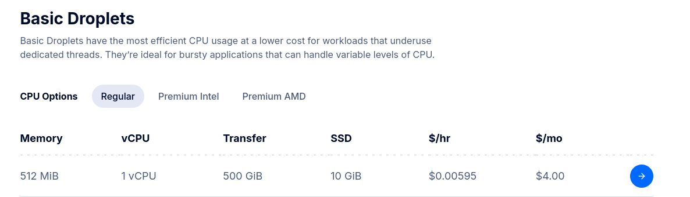

> _Setting up a website from scratch, with a domain, a server and a service_.


## TL;DR

In this guide, we built and deployed a blog website using Go _"and put it on the Internet"_. We covered setting up a server on Digital Ocean, buying configuring a domain from Namecheap, and managing DNS settings. Digital Ocean was chosen for its simplicity and cost-effectiveness for hobby projects. We then detailed the deployment process, including building the Go application, copying files to the server, and creating a `systemd` service to manage the blog. This approach ensures the service runs in the background and restarts on failure. 

Finally, we discussed alternatives like Docker and terminal multiplexers for running the service, offering flexibility depending on the user's preferences and requirements.


## Background

15 years ago when i was in university VMs where all the rage and docker were still some years our. If you wanted to put something on the web, there were basically two options. You could use a shared hosting service for a PHP website, like one.com, or you could rent a VM from a hosting provider and run it your self.

Today i see some of my colleges coming out from university and get right into working on a very high abstraction, docker, kubernetes, serverless, react etc. This is not necessarily a bad thing, but it is easy to miss out on how things actually work where the abstractions "protects" you from having to think about the network, the vms the server and so on. 

To be fair, i think many of my fellow students, back in the days, had no understanding of how servers and the actual web worked. But they layers between your code and html files being delivered to a browser has increased a lot since then, with services as Netlify, Vercel, Lambldas, Cloud Run, Cloudflare, Google Cloud, React, Webpack, Docker, K8s and so on.

The other day I overheard question being asked from a dev, "How do i create a website and how do I get it online?". Mind you this is a person who has been working with web development and are very competent and gets around very well in or stack.

## The Plan

Lets build a blog web site, to display this blog post detailing how to write a service and put it online.


## The App

Alright, so lets not fall in to the trap of having our domain collect dust in the corner. Lets build a website.

I won't do through the entire build here. Instead, i'll link to the repo, [github.com/crholm/raz.sh](https://github.com/crholm/raz.sh) where you can find the code (very small an simple) and the instructions on how to build and run it.

There are however a few things I want to go through here, the basic idea, the architecture amd things that might not be so obvious if you are working high up the abstraction usually.

### The Idea

The service shall read markdown files from a directory and render them as blog posts

This is nothing new in any way about this project, instead this is quite common for people to test, to write your own blogging tool (or at least it was when blogging was hipped back in the days).

### Architecture (or lack there of)
We want this to be as close to the metal as we can, or at least give that feeling. So we will try bundle everything into one binary and use no extra stuff such as docker, nginx cloud, fly.io or whatever.

The checklist
- Directory with markdown files
- HTML templates and some CSS
- A Go Web server using HTTPS/TLS and Lets Encrypt

A note here in regards to the Web, it is very much a special place when it comes to programming. To deliver a website / webapp you can use anyting. You can write things in whatever language you want and you application is treated no different then any other on the web. 

This is not the case for most other platforms. Imagine trying to write a iOS app in C#, Visual Basic or Kotlin. Imagine writing a Android app in Objective C. Imagine writing a Windows app in Bash. But all of these language can put stuff on the web, and no one else treats your service any different.


## The Server

To put things on the internet, the old school way, we need a server. This can be a Raspberry PI in your sock drawer, but the more pragmatic way would be to rent a Virtual Machine (VM) in the cloud. 

> _But you said we should be on the metal!?_

_Yes, yes, I know_. But a VM quite close to a real machine in terms of what we are doing, and much more buget friendly then building a server center for you physical machine.

There are many vendors out there where you can rend a VM by the minute. Some of the big ones are AWS, Google Cloud, Azure, Digital Ocean and Linode. The big three cloud vendors (aws, google and azure) does all of it. But their focus is on enterprise. So if we just need a VM or two, we are much better off with Digital Ocenen and Linode in my opinion.

Im going for Linode for this project. (Which somehow seems to have been bought by Akamai since last time i looked at it and the signup experience has turned really bad)


for $5 a month i get enough power to run this blog.

--- 

Ok scratch that, the **linode** signup experience has gone to complete shit. I don't want to wait for my "account to be reviewed"... Apparently my money smells  

We are going with **Digital Ocean**, and they seem to be even cheaper (less ram, but who needs ram :)




### Creating a VM

Go to `Digital Ocean -> Login -> Droplets -> Create`

I'll configure the VM as

- Run in Amsterdam
- Run Ubuntu 24.04
- Basic 1 vCPU + 512mb RAM
- Adding my SSH key \
`cat ~/.ssh/id_ed25519.pub `

and then click `Create Droplet`


### Accessing a the VM

Alright, alright. Now we got a VM and the ip is `134.209.81.42` as seen above. With the ssh key added in the step above. All i need to do is to SSH to it

```bash 
$ ssh root@134.209.81.42
Are you sure you want to continue connecting (yes/no/[fingerprint])? yes
...
root@ubuntu-s-1vcpu-512mb-10gb-ams3-01:~#
```


## The Domain

We need a domain name! most projects starts of with an idea and a domain being bought... and the end up never using it or writing no more then a few lines of code. Its a right of passage for devs and expect 1/2 of the domains you buy to never be used :).

DNS is the system that translates domain names to IP addresses. The big dog in this is ICANN and they are responsible for the root zone of the DNS. In turn ICANN have delegated the responsibility of the top level domains to different organizations around the world. For example `.com` is managed by Verisign and `.se` is managed by IIS. Talking IIS.se as an example, they do not sell the domains directly to the public, instead they have registrars that they have given the right to sell domains.

`ICANN -> TLD -> Registrar -> You`

So for this purpose we only really need to deal with a Registrar. Domain names are bought through a them, and there are many to choose from. Some prominent are Cloudflare, GoDaddy and Namecheap and for this project i chose the latter. They integrate towards quite a few TLDs and seems to have a fair pricing.

I went to [namecheap.com](https://namecheap.com/), searched around for a domain and bought `raz.sh`. I like short domain names and this one is perfect for a personal blog.


## The DNS 

We bought a domain, and its the registrars role to have the TLD provider to set the Name Service, NS, records for your domain. These basically points out where the DNS server for your domain is. Who should you ask for the IP of `raz.sh` in this case.

We bought our domain from Namecheep they have set the ns records to point to their DNS server

```bash 
$ dig ns raz.sh
;; ANSWER SECTION:
raz.sh.                 1714    IN      NS      dns2.registrar-servers.com.
raz.sh.                 1714    IN      NS      dns1.registrar-servers.com.
```

This mean that i can use the namecheep DNS server to set the A record for `raz.sh` to point to the IP of the VM. These days most registers provide a DNS server for you to use in order to manage your domain. However, if you are looking to do any serios work, i suggest you "move" the domain to Cloudflare by signing up for an account and pointing the NS records to Cloudflare. They provide a lot of services for free and are very good at what they do.

There used to be a saying "If you are seeing strange behavior on the network, its the DNS". Mening that its well worth it to use a vendor how has a good DNS service. Most registrars **do not** have a good DNS service.


### Records

Since we are hosting our own server we want to point the A record to the IP of the VM. This will direct a browser to the IP of the VM when someone types in `raz.sh`


This can seem confusing, the `@` sign is a shorthand for the domain name itself. So `@` is the same as `raz.sh`. If i wanted to use a subdomain, like `blog.raz.sh` i would write `blog` in the name field.

the `TTL` field is Time To Live and simply indicates for a client how long we should cache the DNS respones. Eg below it says 300, meaning 300 seconds or 5 minutes. This is a very low value and is good for testing. In production you would want to set this to something like 3600. (DNS is a distributed key-value store, and the TTL is the time a DNS client will cache the response before asking again)

All done with the DNS for now

> Dont worry if the correct ip does not show up emediatly. DNS is a distributed system and it can take some time for the changes to propagate. You can use the `dig` command to check the status of the DNS records

```bash 
dig A raz.sh
;; ANSWER SECTION:
raz.sh.                 300     IN      A       134.209.81.42
```

and now we can ssh with the domain name

```bash
ssh root@raz.sh
...
root@ubuntu-s-1vcpu-512mb-10gb-ams3-01:~# 
```

or ping it

```bash 
ping raz.sh
PING raz.sh (134.209.81.42) 56(84) bytes of data.
64 bytes from 134.209.81.42: icmp_seq=1 ttl=47 time=27.8 ms
...
```


## The Deployment

Ok, so now we have a software, a server and a domain. Lets put the software on the server and make it available on the domain.

### Building the service

So the blog service is written in Go and we will be running things on a Linux VM. So building the app should be a breeze.

```bash
git clone https://github.com/crholm/raz.sh.git
cd raz.sh
$ GOOS=linux GOARCH=amd64 go build razsh.go
$ ls razsh*
razsh  razsh.go
```

Almost everything we need is now contained in the binarey `razsh`

### Copying the binary and content to the server 
```bash
scp ./razsh root@raz.sh:/root
scp -r './data' root@raz.sh:/root
```


### Hello world
Now that everything we need is on the server, its time to start the service. 

```bash
ssh root@raz.sh
root@ubuntu-s-1vcpu-512mb-10gb-ams3-01:~# ls
data  razsh
root@ubuntu-s-1vcpu-512mb-10gb-ams3-01:~# ./razsh serve \ 
  --data-dir=./data 
```

This starts the service on port 80 (unencrypted http) and makes it available on the domain **http**://raz.sh/


#### TLS
So we want the connections to be secure. This is done through tls. The s in http**s**. This is done by using a certificate. The most common way to get a certificate is through Lets Encrypt. They provide free certificates and are very easy to use. In fact the razsh binary already have support for this built in to make life esier

```bash
root@ubuntu-s-1vcpu-512mb-10gb-ams3-01:~# ./razsh serve \ 
  --data-dir=./data \
  --hostname=raz.sh \  ## Domain that the tls certificate should be issue
  --tls                ## Turns on TLS in razsh and starts serving on port 443, https
```

Now visiting raz.sh should redirect you to http**s** and it might take a few seconds the first time as the certificate is being issued.


If you are not writing thins in Go or want to structure your app abit more. Putting a ingress proxy infront of your app, that handles the tls, might be a god idea. Some known ones are Nginx, Caddy and Traefik. These can also handle things like load balancing, caching, rate limiting and so on.

### But is it a service?

We have a website running, but is it a service? if we terminate the terminal och press ctrl+c the service will stop. This is not a service. A service is something that runs in the background and is started when the server/vm starts. Back in the days these were named daemons, and in linux they are still called that sometimes.

A service is simply something that doesn't terminate just because the terminal is closed. It is started and runs in the background. These days, in a modern Linux dist, this is done through `systemd` and the `systemctl` or `service` cli. eg. `systemctl status docker` or `service docker status`.

#### Creating a service 

A service managed by systemd is not much more than a manifest with some meta data in regards to you binary or script, so lets create a simple one for razsh

```bash
ssh root@raz.sh
$ echo "[Unit]
Description=raz.sh Blog Service
After=network.target

[Service]
ExecStart=/root/razsh serve --data-dir=/root/data --hostname=raz.sh --tls
Restart=always
User=root
WorkingDirectory=/root

[Install]
WantedBy=multi-user.target" > ./razsh.service

$ ln -s /root/razsh.service /etc/systemd/system/razsh.service

$ systemctl enable razsh.service
$ systemctl start razsh.service
$ systemctl status razsh.service
● razsh.service - raz.sh Blog Service
     Loaded: loaded (/etc/systemd/system/razsh.service; enabled; preset: enabled)
     Active: active (running) since Wed 2024-09-25 13:35:32 UTC; 52s ago
   Main PID: 4334 (razsh)
      Tasks: 4 (limit: 509)
     Memory: 2.1M (peak: 2.3M)
        CPU: 14ms
     CGroup: /system.slice/razsh.service
             └─4334 /root/razsh serve --data-dir=/root/data --hostname=raz.sh --tls
```

What about the pretty logs that i got in my terminal when run from a cli? Now we can access them through `journalctl`

```bash
$ journalctl -u razsh.service
## or, to follow the logs
$ journalctl -u razsh.service -f
## or remotely
$ ssh root@raz.sh journalctl -u razsh.service -f
```

##### Deploying 
For deploying a new version we have to stop the service, replace the binary and start the service again. 

```bash
# Build a new version
$ GOOS=linux GOARCH=amd64 go build razsh.go

# Stop the service
$ ssh root@raz.sh systemctl stop razsh.service

# Replace the old binary with the new one
$ scp ./razsh root@raz.sh:/root/razsh

# Restart the service
$ ssh root@raz.sh systemctl start razsh.service

# Check the status of the service
$ ssh root@raz.sh systemctl status razsh.service

```

### Alternatives

#### Docker
There are many ways to put a service on the web. The above is the most basic way to do it. I, my self, like docker, so instead of creating a service in the manner above, i usually end up creating a container and that acts more or less as a service. (This has the added benefit of isolating the process as well.)

This might be something like the following once a container containing the razsh binary is created

```bash
docker run --detach \
  --name razsh \
  --restart always \
  --publish 80:80 \
  --publish 443:443 \
  --volume /root/data:/data \
  <image_name> serve \
    --data-dir=/data \
    --hostname=raz.sh \
    --tls 
```

#### Screen & Tmux
So if you just want something to survie you terminating the connection to the server you can use `screen` or `tmux`. These are terminal multiplexers that allow you to run a terminal session in the background and then reattach to it later. 

```bash
$ screen
$ ./razsh serve --data-dir=./data --hostname=raz.sh --tls
```
Then press `ctrl+a` and `d` to detach from the screen session. You can then reattach to the session with `screen -r`

## Conclusion

And there we have it. A running server on the web, hosting a blog for anyone to read. We have gone through the basics of setting up a server, buying a domain, setting up DNS, deploying a service and making it a service.