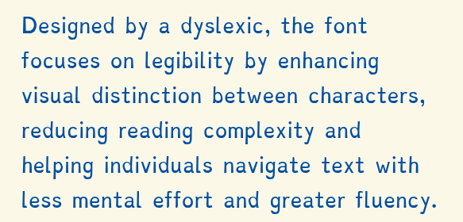

## TL;DR

People with dyslexia have difficulties reading text. Some of the things
used to improve readability, fonts, shaping text,
spacing and so on are probably just good practice in general and should be
considered all users, regardless of them having
dyslexia or not.

**For the web**

```css
p {
/* Use sans serif fonts designed for screen readability. 
   Lexend is specifically designed for readability and to 
   reduce visual stress. Verdana and Arial are widely 
   available sans-serif fonts also known for good 
   legibility. */
  font-family: "Lexend", Verdana, Arial, sans-serif;

/* Increase letter spacing (tracking) to prevent letters
   from appearing too crowded, which can improve 
   readability for some users. 0.1em provides a noticeable 
   but not excessive increase. */
  letter-spacing: 0.1em;

/* Increase spacing between words to help distinguish them
   more clearly. Similar to letter-spacing, this can aid 
   readability. 0.1em adds a small amount of extra space. */
  word-spacing: 0.1em;

/* Set the line height (leading) to increase the space 
   between lines of text. A value of 1.5em (or 150%) is 
   commonly recommended for better readability, as it 
   prevents lines from being too close together */
  line-height: 1.5em;

/* Add space below each paragraph to improve the separation 
   between blocks of text, making the overall page easier to 
   scan and read. 2em provides a clear visual break. */
  margin-bottom: 2em;

/* Limit the maximum width of paragraphs to 75 characters, 
   which is a common recommendation for comfortable reading. 
   This can help prevent text from stretching too far and 
   making it difficult to read. */
  max-width: 75ch;
}
```

## Intro

I have dyslexia and got the diagnosis way back in the early 90s, before it
was cool or even known to most.
My teachers' reaction was "I don't really know what that is, why can't just
sit down and read?" probably confusing
with ADHD and other disabilities. My parents were quite insistent on
getting me a diagnosis in order for me to get the
help, that my dad never received when growing up.

To be honest, once I started Highschool, I had developed strategies to
handle learning, reading and writing
(painful as it was for me and my parents), and I haven’t really perceived
it as a disability or disadvantage since.

Looking back at it, it was probably a good thing that I choose to become an
engineer, instead of an MD, where the first years of
university were just one book of maths. 😄

## Symptoms

There are quite a few symptoms for dyslexia but the major ones are

- Difficulty reading and writing text, letters and words seem to jump
  around
- Difficulty spelling words, and spelling the same word differently every
  time

There are also some positive traits that seem more common in people with
dyslexia, such
as high IQ, good abstract reasoning and thinking. And some for the most
part inconsequential traits, such as hard time telling
left
from right. (I still check for a scar i have on my left hand every time I'm
asked about left or right. My 4-year-old seems to do
a better job than me in telling right and left apart for the most part.)


## Reading

This post is, however, focused on the reading part of dyslexia, and
specially on screens. Since dyslexia has become more
"popular", more accessibility tools and research on the topic has been
done.

For example, there are fonts, opendyslexic.org and dyslexiefont.com, that
is specifically made to be readable by people with
dyslexia.
It focuses on making the characters as distinct as possible, anchors each
character to the same imaginary line,
emphasizes the bottom of the character, enlarged openings, no serifs and
increased spacing.

\
Source: [dyslexiefont.com](https://dyslexiefont.com/)

I do feel that these fonts make it easier for me to read, especially
dyslexiefont.com, they do look ridiculous and
ugly, imho, and is not something I would subject myself to, nor forcing it
onto any users.

## Takeaways

Looking at the research, there are some clear patterns that can be used to
improve the reading experience for users with
dyslexia. It is probably a good practice to implement some of these
patterns for all users, regardless of them having
dyslexia or not, since it will increase readability in general.

### Fonts

Opt for sans-serif fonts ("sans" means without the small decorative strokes
at the ends of characters) as they are generally
considered more screen-friendly. Look for fonts with distinct character
shapes to prevent confusion between similar letters and
those that provide a clear, stable baseline for the text to rest on. Many
widely available sans-serif fonts can significantly
improve readability without compromising on aesthetics.

Some good examples are

- **Lexend** 
  [fonts.google.com/specimen/Lexend](https://fonts.google.com/specimen/Lexend) \
  This font family was specifically designed with the goal of improving
  reading comprehension and reducing visual
  stress [lexend.com](https://lexend.com)
- **Open Sans** 
  [fonts.google.com/specimen/Open+Sans](https://fonts.google.com/specimen/Open+Sans)\
  A humanist sans-serif known for its open letterforms and excellent
  legibility.
- **Noto Sans** 
  [fonts.google.com/specimen/Noto+Sans](https://fonts.google.com/specimen/Noto+Sans)\
  Part of a Google project to create a harmonious look and feel across all
  languages, Noto Sans is designed for clarity.

```css 
p {
    font-family: "Lexend", Verdana, Arial, sans-serif;
}
```

#### Font Size

Once you've selected a suitable font family, setting an appropriate font
size is crucial. A common recommendation for body text is
around 1.2rem. 1.2 times the root element's font size, which is often the
browser's default (typically 16px) results in paragraph
text of about 19px, offering good readability.

```css 
p {
    font-size: 1.2rem;
}
```

### Spacing

Thoughtful use of spacing can significantly impact readability, especially
for individuals with dyslexia. When letters and lines
are too close together, the text can appear as a dense block, making it
difficult to distinguish individual words and track lines.
Increasing spacing creates visual breathing room, allowing the eye to move
more easily across the text.

#### Letter Spacing (Tracking):

As mentioned in the TL;DR, increasing letter spacing, also known as
tracking, can be beneficial. Aim for an increase of around 35%
of the average character width. In CSS, this translates to values between
about 0.05rem and 0.15rem.

```css 
p {
    /*0.05em - 0.15em*/
    letter-spacing: 0.1em;
}
```

#### Word Spacing

Increasing the space between words can also improve readability. When words
are too tightly packed, it can be harder to identify
word boundaries, leading to misreading and slower comprehension. A slight
increase in word-spacing can make a noticeable
difference.

```css 
p {
    /*0.1em - 0.3em*/
    word-spacing: 0.1em;
}
```

#### Line Height (Leading)

Adequate line height, or leading, is crucial for comfortable reading. When
lines of text are too close, the eye can easily jump to
the wrong line, disrupting the reading flow. A line height of at least 1.5
times the font size (line-height: 1.5em) is a good
starting point. For even better readability, especially for longer blocks
of text, you might consider slightly increasing this
value.

```css 
p {
    /*1.5em - 2em*/
    line-height: 1.5em;
}
```

#### Paragraph Spacing (Margins)

Creating visual separation between paragraphs helps readers to process
information in manageable chunks. Adding margin below
paragraphs (margin-bottom) provides this necessary whitespace.

```css
p {
    margin-bottom: 2em;
}
```

#### Paragraph Width

Beyond font choice and spacing, the width of your text blocks significantly
affects readability. If lines of text are too wide, it
becomes challenging for the eye to track from the end of one line to the
beginning of the next. This can lead to fatigue, reduced
reading speed, and difficulty comprehending the content. 

Personally, if
lines stretch too far and its late i the day, it is
almost uncomfortable for me due to the amount of
focus needed to read it. This makes me so frustrated with gmail. It has been 
around for 20+ years and they still havn't figured out how to add a max width.

The optimal line length for comfortable reading is generally considered to
be between 45 and 75 characters per line. 
```css
p {
    max-width: 75ch;
}
```